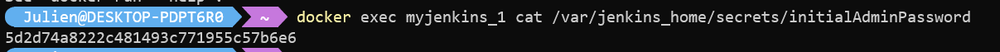
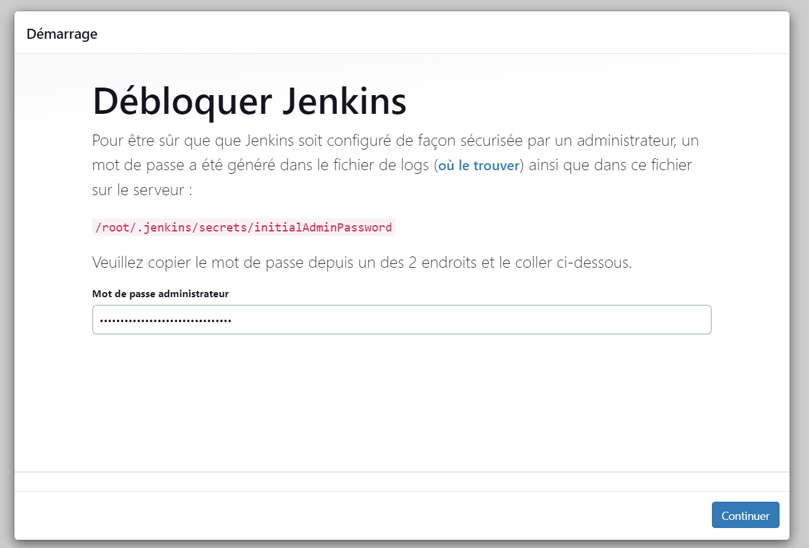
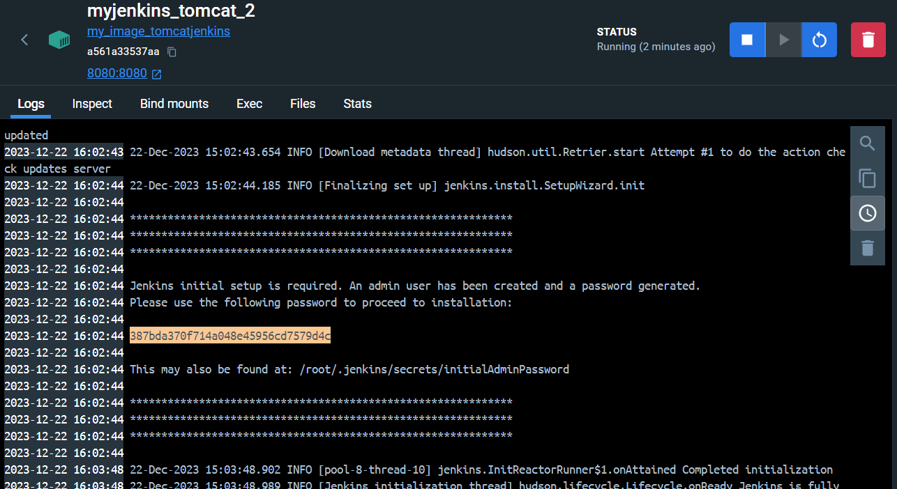

# I – Proposer un service

1. La récupération de l’image jenkins depuis le hub docker.
`docker pull jenkins/jenkins:latest`

2. Le démarrage du conteneur proposant le service.
> Le premier -p 8080:8080 permet d'accéder a la page web de jenkins depuis le port 8080 de l'hôte.
> Le second -p 50000:50000 permet d'accéder au service jenkins depuis le port 50000 de l'hôte.
`docker run --name myjenkins_1 -p 8080:8080 -p 50000:50000 jenkins/jenkins`

2.1. La récupération du mot de passe
Quand on va sur l'adresse http://localhost:8080/, on nous demande de rentrer le mot de passe.
> /var/jenkins_home/secrets/initialAdminPassword : chemin du fichier contenant le mot de passe
`docker exec myjenkins_1 cat /var/jenkins_home/secrets/initialAdminPassword`

3. La vérification de la disponibilité du service.
`docker ps`

4. L’arrêt du conteneur associé.
`docker stop myjenkins_1`

# II – Service « from scratch »

Le but de cet exercice est de reconstruire un conteneur docker proposant un service Jenkins à partir d’une base Tomcat.
La démarche se déroule en quatre temps à savoir :
1. La récupération des ressources.
`docker pull tomcat:9`

2. La rédaction d’un fichier Dockerfile.

- Voir le fichier [Dockerfile](./Dockerfile) pour plus de détails.

3. La construction de l’image.
`docker build -t <nom_image> <chemin_dockerfile>`
> -t : prend en paramètre le nom de l’image à construire

`docker build -t my_image_tomcatjenkins .`
> 💡 Il est logique de taper la commande ci-dessus dans le même dossier que le Dockerfile...

4. Le test du service.
> 8080:8080 : `<port_hôte>:<port_conteneur>`
`docker run --name myjenkins_tomcat_2 -p 8080:8080 my_image_tomcatjenkins`

5. On peut maintenant accéder à l'interface web de jenkins sur l'adresse http://localhost:8080/jenkins

et on peut aussi se rendre au serveur tomcat sur l'adresse http://localhost:8080

- Il va falloir rentrer le mot de passe qui se trouve dans le fichier `/var/jenkins_home/secrets/initialAdminPassword` du conteneur ou directement dans la console du conteneur 

